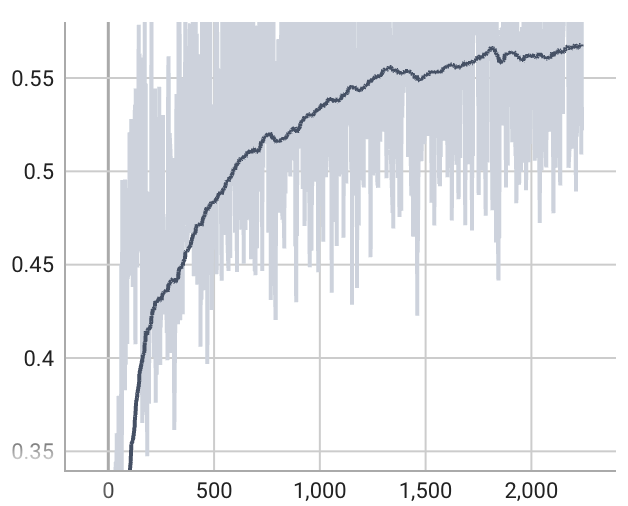
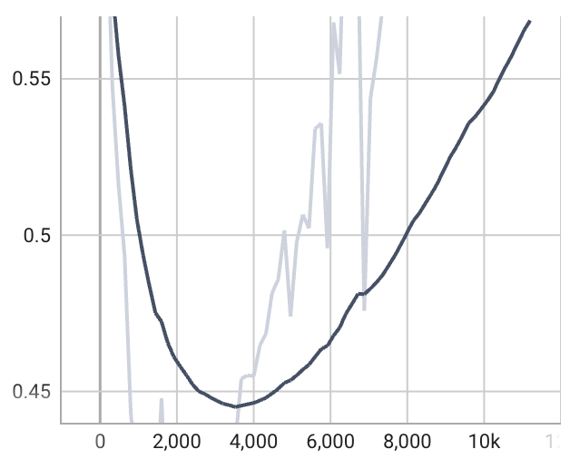
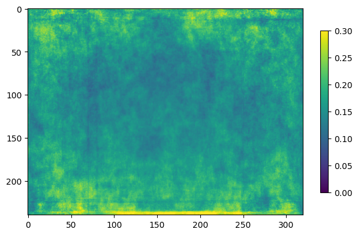

# Kandinsky calibration for image segmentation models

bla

## Example usage

We will train, calibrate and evaluate a model on the MS-COCO dataset, restricting attention to the "person" class.

### Preparation
Start by installing the requirements (preferably in a conda environment):

    python -m pip install -r requirements.txt

Now we need to download MS-COCO and prepare the relevant subset. We use ``fiftyone`` for this. Configure the target directories in ``src/utils/coco-prepare.py`` and run the file. The download and export will take a while (~1.5h approximately). The test set of MS-COCO is not labeled, so we repurpose the validation set for testing. We then split the original train set into train, validation, and calibration data.

Our goal is to calibrate a miscalibrated model. Obtaining such a miscalibrated model is easier if we train on a small number of images. We also do not need many validation images, since optimizing training is not relevant here. We therefore use most of COCO's original train split as calibration data (and we can later choose to reduce the number of calibration images to evaluate different calibration methods in a low-data scenario). To make the train/validation/calibration manifest files, run ``src/utils/coco-split.py``.

The notebook ``notebooks/check-coco.ipynb`` can be used to verify that the training and validation splits were properly created and that they can be located by the ``CocoDataset``.

### Training
Set the environment variables ``DATA_TRAINVAL_ROOT`` and ``DATA_TEST_ROOT``. A sample training configuration for training a UNet on 1000 images (this split should have been created in the preparation step) is provided in ``configs/experiment/train_coco-person_t1000.yaml``. Run

    python src/train.py experiment=train_coco-person_t1000

until you get sufficiently many model checkpoints to choose from. The models with a larger generalization gap (``val_loss - train_loss``) are usually less calibrated,[1](https://arxiv.org/abs/2210.01964) and are therefore good testing grounds for the Kandinsky method. Furthermore, the validation Dice score will usually keep rising even after validation loss has hit a minimum, which is another reason that you might not want to stop training early. In the default setup, 250 epochs of training should suffice. Validation Dice and loss curves will look approximately like this:

 

You can check the (mis)calibration properties of the model checkpoints by running

    python src/eval.py ckpt_path=logs/train/runs/train_coco-person_t1000/<rest of checkpoint path>

and inspecting the resulting images in ``logs/eval/...``. Here we show an example of the Expected Calibration Error (ECE) plotted for each individual pixel:

### Calibrating
Calibration amounts to evaluating the trained model on a calibration set and storing the resulting non-conformity scores per pixel. These can subsequently be used for computing non-conformity *curves*, where the chosen calibration method (i.e. pixel/image/kandinsky) determines how we go from the *scores* to the *curves*.

Running pixelwise or imagewise calibration is as simple as

    # pixelwise
    python src/calibrate.py experiment=cal_coco-person_t1000_c20000_pixel ckpt_path=logs/train/runs/train_coco-person_t1000/...
    # imagewise
    python src/calibrate.py experiment=cal_coco-person_t1000_c20000_image ckpt_path=logs/train/runs/train_coco-person_t1000/...

In this example we are using 20.000 images for calibration (i.e. a very large calibration set). The calibrated checkpoint is stored in a subfolder of ``logs/calibrate/runs/cal_coco-person_t1000_c20000_<method>`` as ``cmodel.ckpt``. This checkpoint has a field ``nc_curves`` that contains the nc-curves (i.e. 100 equally spaced quantiles of the nc-scores) for every pixel in the form of a ``[100, C, H, W]`` tensor. Depending on the chosen calibration method, these curves may differ per pixel (pixelwise), be identical for every pixel (imagewise), or differ by pixel grouping (kandinsky). The upshot is that this tensor can be used for creating each pixel's prediction set at the desired confidence level (with a resolution of 1%).
